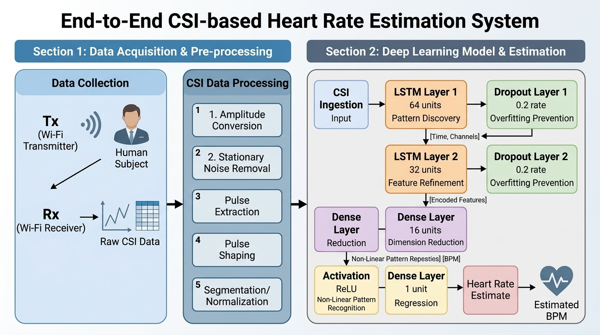
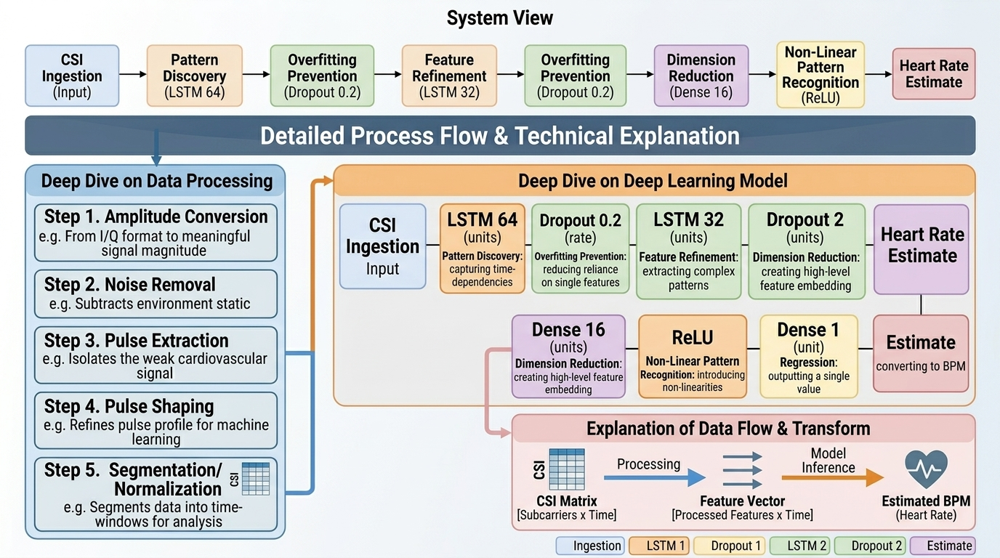

# Wi-Fi CSI Contactless Heart Rate Monitor 🫀📶

> **Non-invasive, contactless vital sign tracking using commodity Wi-Fi hardware.**

Welcome to the **Wi-Fi CSI Contactless Heart Rate Monitor** project (inspired by the Pulse-Fi architecture). This repository provides a complete, publication-grade pipeline for estimating human heart rate in real-time by analyzing subtle perturbations in Wi-Fi signal propagation caused by cardiac motion.

---

## 🏗️ System Architecture Overview

The system operates across three primary stages, forming an end-to-end pipeline from signal acquisition to physiological prediction.



### 1. Data Collection
The hardware setup utilizes two ESP32 microcontrollers. One acts as a **Transmitter (Tx)**, emitting a steady, continuous stream of Channel State Information (CSI) packets. The other acts as a **Receiver (Rx)**. 
When a human target sits or stands between the Tx and Rx nodes, their subtle biological movements (specifically, the chest displacement caused by a heartbeat) alter the multi-path signal propagation. The receiver captures these perturbed signals.

### 2. CSI Data Processing
The raw, noisy CSI packets are pushed through a rigorous 5-step digital signal processing (DSP) pipeline to isolate the cardiac signature:
1. **Amplitude Conversion:** Transforms complex raw CSI matrices into magnitude/amplitude values.
2. **Stationary Noise Removal:** Applies filtering to strip out static reflections from the surrounding environment (walls, furniture).
3. **Pulse Extraction:** Isolates the specific micro-frequency band corresponding to human cardiac motion.
4. **Pulse Shaping:** Smooths the extracted waveform to remove high-frequency artifacts.
5. **Segmentation/Normalization:** Windows and structures the continuous stream into normalized batches ready for the neural network.

### 3. Heart Rate Estimation
The processed signal window is fed into a specialized Long Short-Term Memory (LSTM) Artificial Neural Network. This deep learning model is trained to recognize the specific waveform signatures of heartbeats and predict real-time Beats Per Minute (BPM).

---

## 🧠 Deep Learning Pipeline Breakdown

The predictive core of this project is built using TensorFlow/Keras. We employ a stacked LSTM architecture optimized for sequential time-series data. It ingests a sliding window of 100 sequential, processed CSI packets and outputs a scalar BPM value.



### Network Architecture

The model architecture is specifically tailored to balance pattern discovery and prevent overfitting on small physiological datasets:

| Layer | Type | Configuration / Details | Purpose |
| :--- | :--- | :--- | :--- |
| **Input** | `Input Layer` | Shape: `(100, 192)` | CSI Ingestion of a sliding window. |
| **Layer 1** | `LSTM` | 64 units, `return_sequences=True` | **Pattern Discovery:** Captures temporal dependencies across the sequence. |
| **Layer 2** | `Dropout` | Rate: `0.2` | **Overfitting Prevention:** Randomly drops connections during training. |
| **Layer 3** | `LSTM` | 32 units | **Feature Refinement:** Distills the discovered temporal features. |
| **Layer 4** | `Dropout` | Rate: `0.2` | **Overfitting Prevention:** Secondary regularization layer. |
| **Layer 5** | `Dense` | 16 units | **Dimension Reduction:** Compresses features into higher-level representations. |
| **Layer 6** | `Activation` | Function: `ReLU` | **Non-Linear Pattern Recognition:** Introduces non-linearity to the network. |
| **Output** | `Dense` | 1 unit | **Heart Rate Estimate:** Final scalar prediction (BPM). |

---

## 🛠️ Hardware & Environment Setup

### Bill of Materials (BOM)
To replicate this setup, you will need the following commodity hardware:
- **1x Adafruit HUZZAH32** (or equivalent ESP32-WROOM-32E) – Used as the Wi-Fi Transmitter.
- **1x ESP32-DevKitC v4** (or equivalent ESP32-WROOM-32E) – Used as the Wi-Fi Receiver (connected via USB).
- **1x Arduino Nano 33 IoT** – Used *only* for gathering ground-truth training data.
- **1x MAX30102** pulse oximetry sensor module – Used *only* for gathering ground-truth training data.

### Firmware Installation
The microcontrollers must be flashed with customized firmware to expose the CSI extraction capabilities. We utilize official Espressif tools via Docker for consistency.

1. Install Docker on your host machine.
2. Pull the official Espressif IDF Docker containers.
3. Flash the Transmitter board with the `csi_send` firmware.
4. Flash the Receiver board with the `csi_recv` firmware.

### Physical Positioning Guidelines
- Place the Tx and Rx nodes approximately 1 to 2 meters apart.
- Ensure the target subject is positioned directly within the Line-of-Sight (LoS) or just off the LoS between the two antennas.
- Keep the environment relatively static (minimize walking or moving objects nearby) during recording to avoid interference.

---

## 📊 Data Collection & Model Training

To train the LSTM model, you must pair the ambient Wi-Fi data with synchronized, highly accurate ground-truth heart rate readings.

### Collecting Training Data
We use the Arduino Nano 33 IoT and the MAX30102 pulse oximetry sensor to collect this ground truth.
1. Connect the MAX30102 to the Arduino Nano 33 IoT.
2. Attach the sensor to the subject's finger.
3. In the main processing script, toggle the data collection flag:
   ```python
   COLLECT_TRAINING_DATA = True
   ```
4. Run the main script to generate paired datasets mapping raw CSI windows to the MAX30102 BPM readings.

### Training the Model
Once sufficient data is collected, initiate the training routine:
```bash
python train.py
```
This script handles the training routines mapping historical processed CSI data to the MAX30102 ground truth and saves the trained model weights.

---

## 🚀 Usage Instructions

For real-time heart rate inference on a new subject, ensure `COLLECT_TRAINING_DATA = False`, and execute the main inference script. You must specify the serial port connected to your ESP32 Receiver node.

```bash
python read_and_process_csi.py -p /dev/ttyUSB0
```
*(Note: Replace `/dev/ttyUSB0` with your actual serial port, e.g., `COM3` on Windows or `/dev/cu.usbserial-...` on macOS).*

The script will automatically:
1. Handle real-time serial reading from the receiver.
2. Execute the 5-step processing pipeline.
3. Handle model prediction to output the predicted Heart Rate (BPM) in real-time.

---

## ⚠️ Medical Disclaimer

**For Educational and Research Purposes Only.**

This project is an experimental, open-source demonstration of utilizing Wi-Fi Channel State Information (CSI) for vital sign monitoring. It is **NOT** a validated medical device, nor is it intended to diagnose, treat, cure, or prevent any disease or medical condition. 

Do not rely on this system for personal health decisions or clinical assessments. Always consult a qualified healthcare professional for medical advice and accurate physiological monitoring.

---
*Inspired by the Pulse-Fi architecture.*
